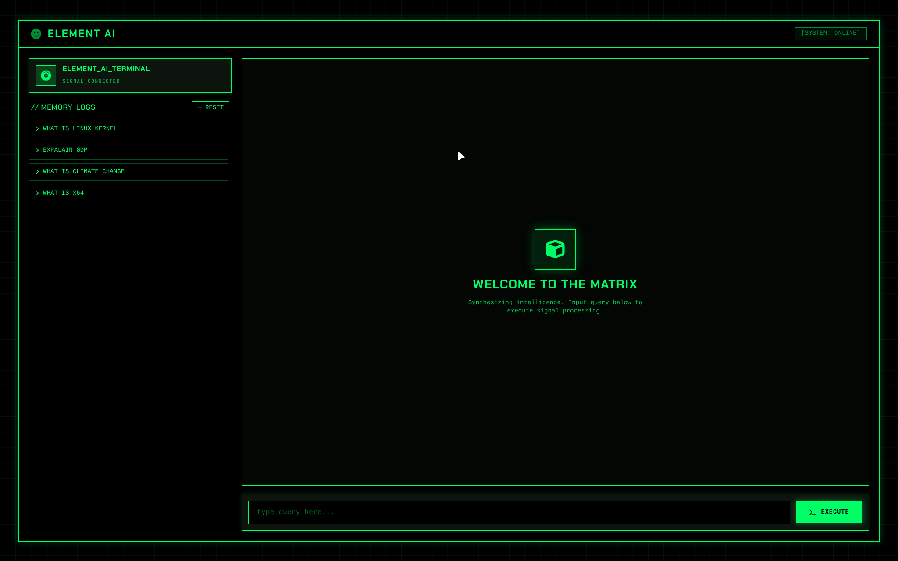
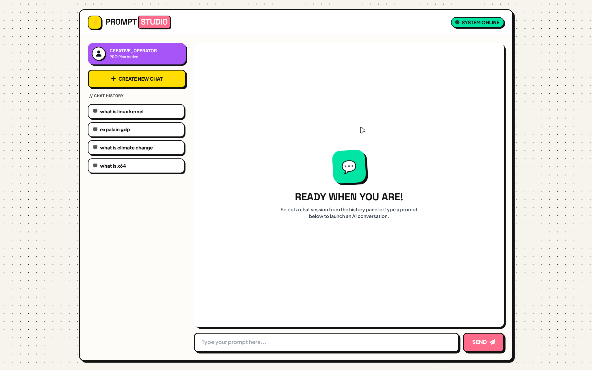
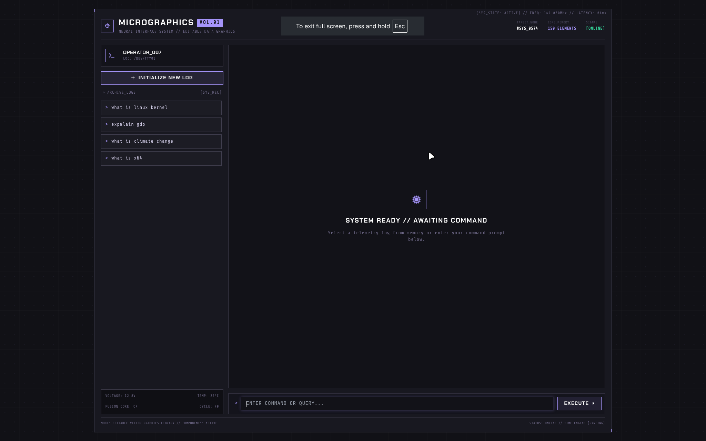
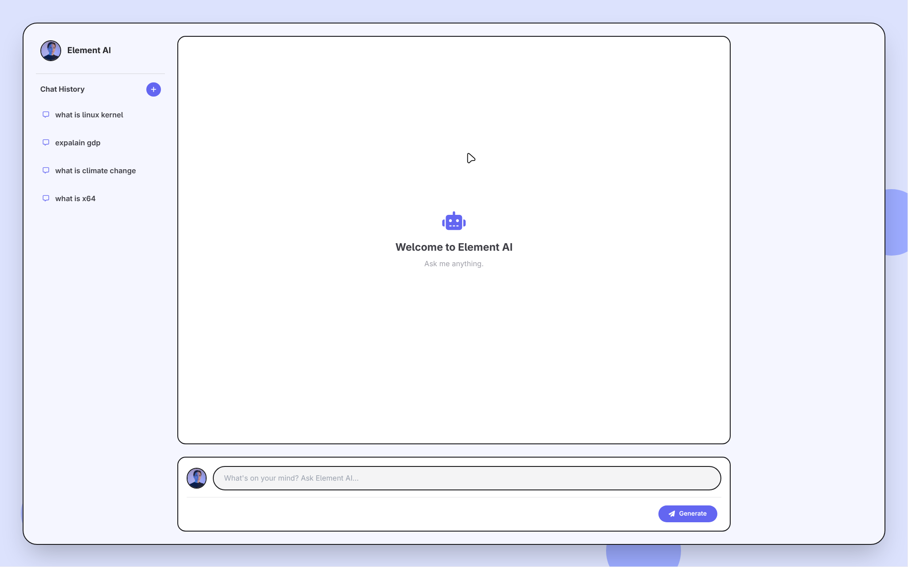

#  Element AI

> A modern, neo-brutalist AI ChatBot Studio designed for flexible prompt engineering, multi-agent workflows, and seamless chat interactions.

---

##  Interface Overview

<div align="center">

| Preview 1 | Preview 2 |
| :---: | :---: |
|  |  |
| **Theme 1** | **Theme 2** |
|  |  |
| **Theme 3** | **Theme 4** |

</div>

---

##  Overview

**Element AI** is an intuitive web-based interface designed to make interacting with AI models both powerful and visually engaging. Featuring a distinctive neo-brutalist design with high-contrast borders and vibrant pop-UI accents, Element AI gives users a streamlined space to chat with assistants, generate creative prompts, and tune model parameters in real time.

---

## ✨ Key Features

* ** Neo-Brutalist Aesthetic:** Clean, high-contrast, pop-UI styling built with Tailwind CSS and custom stroke borders.
* ** Centered Response Studio:** Focus-driven conversation layout designed to maximize readability and workspace output.
* ** Prompt Creator:** Dedicated parameter buttons for quick switching between video generation, code/image prompts, and tone/mood adjustments.
* ** Multi-Agent Workspaces:** Seamlessly organize chats by AI personas (e.g., Travel Advisor, Coder Agent, Copywriter).
* ** Fine-Grained Controls:** Quick access to active model settings, temperature tuning, max tokens, and system prompt overrides.
* ** Fully Responsive:** Clean 3-column desktop grid that collapses gracefully on tablet and mobile devices.

---

##  Tech Stack

* **Frontend:** HTML5, [Tailwind CSS](https://tailwindcss.com/), [Font Awesome 6](https://fontawesome.com/)
* **Typography & Styling:** System UI fonts, Custom SVG/CSS Neo-Brutalist borders
* **Backend:** *Fast API, Python*
* **Supported AI Models:** Groq

---

##  Quick Start

### Prerequisites

* Any modern browser (Chrome, Firefox, Safari, Edge).
* A simple HTTP server or VS Code Live Server (optional).

### Setup Instructions

1. **Clone the repository:**
   ```bash
   git clone [https://github.com/your-username/element-ai.git](https://github.com/your-username/element-ai.git)